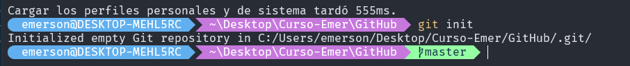
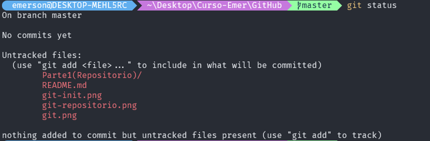
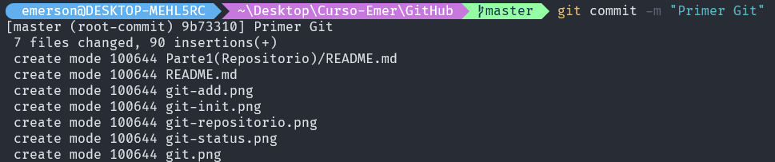
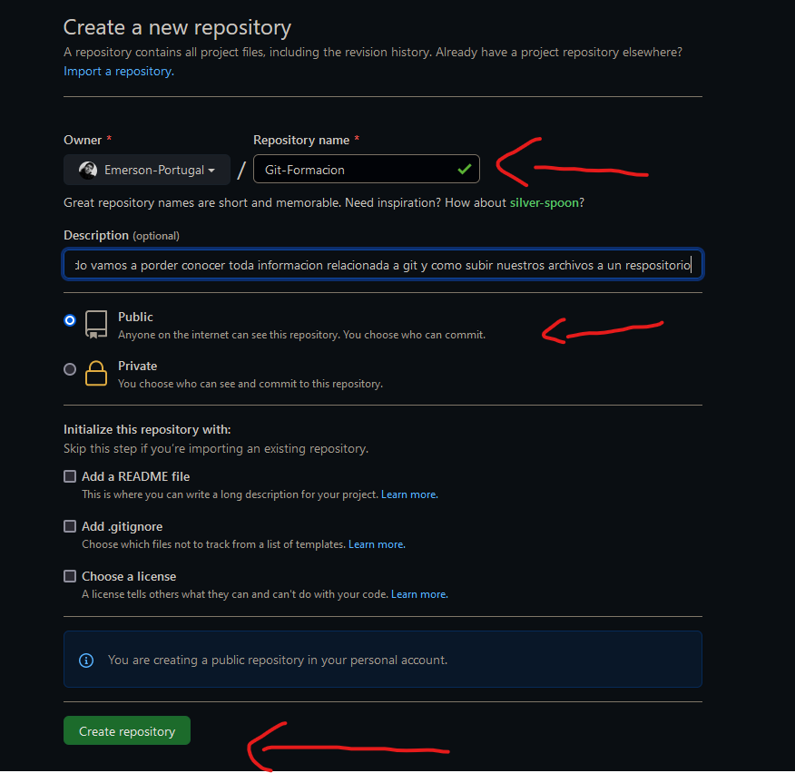
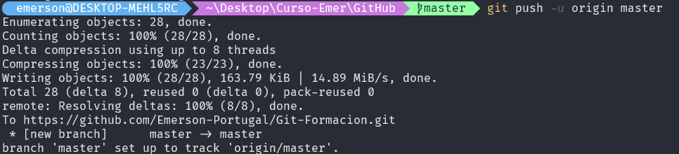
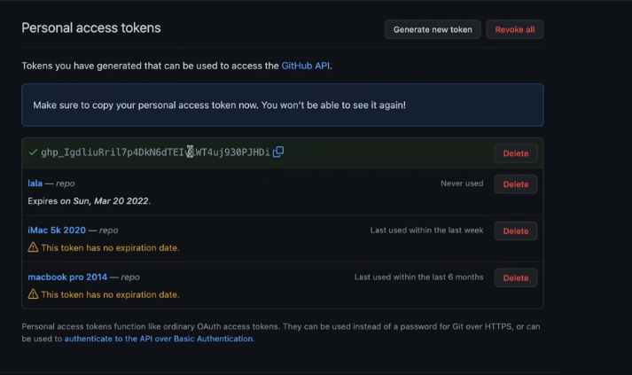

## Primeros pasos `(github)`
:wink: :wink: :wink: :wink: :wink:
### Inicialalizacion

> Vamos a inicializar git, hay que tener en cuanta que primero vemos estar logueados de forma global

``` 
$ git config --global user.name "John Doe"
$ git config --global user.email johndoe@example.com
```
> Es lo primero que debes de hacer antes de usar github

### Primer Paso 

> Despues de a ver escribito, nuestro codigo y sea ya denuestro agrado, empezamos con la subida de nuestro codigo a github.com

```
git init
```


>Esto activara la raiz    `   master o main `, cual nos va a permitir seguir con el proceso


### Segundo Paso 

> Aqui vamos a ver, cuales con los archivomos que tenemos que subir a github, esto se puede saber con el siguente comando

```
git status 
```


> Con esto vamos a sabes que archivos vamos a querer subir al repositorio


### Tercer Paso

> Con este comando vamos a poder seleccionar, que archimos a querer subir al repositorio, `git add .` -> no es muy remendable su uso, siempre y cuando separ muy bien que es lo que vas a subir, `git add  index.html` -> es un mejor uso.

``` 
git add archivo
```


### Cuarto Paso 

> En este paso vamos a poder implementar, un comentario al repositorio a la hora de subirlo, esto nos va permite saber, los cambios que vamos haciendo en el proyecto, para asi volver cuando sea necesario. 

```
git commit -m "Primer commit"
```


### Quinto paso 

> Vamos a crear nuestro repositorio, en el cual vamos subir nuestro archivo



> En los espacios para llenar, le puedes dar el nombre que tu gustes, con los valores que mas te con viene.

### Sexto paso 

> En este punto ya vamos a subir nuestro archivo a github, pero antes tenemos que hacer un ultimo comando.

```
git remote add origin https://github.com/Emerson-Portugal/Git-Formacion.git

```


> Se va a encargar de hacer la conexion  con el repositorio github

### Septimo Paso

> Vamos a subir el archivo con  el comando

```
git push -u origin `main o master`
```




### Octavo Paso

> Aqui nos va a pedir que ingresemos nuestro  usuario y contraseña

#### `Ingreso de usuario`

> Aqui vas a ingresar tu nombre de usuario de github


#### `Ingreso de contraseña`

